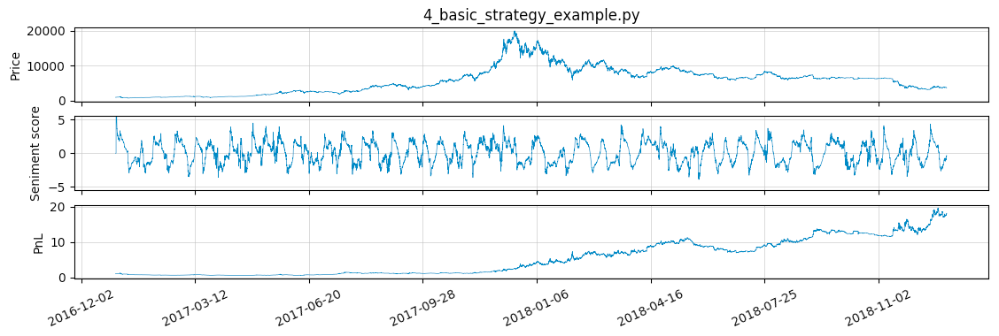

  

# Quant Reseach

This repo serves as a quickstart guide for using using Augmento sentiment data, as well as a working repo for analysing the data and developing example strategies.

Augmento API docs: http://api-dev.augmento.ai/v0.1/documentation

Bitmex API docs: https://www.bitmex.com/api/explorer/

## Getting started

Prerequisites

	python 2.7 or later

Install requirements

	pip install -r requirements.txt --user

Run tests

	python -m unittest discover -v

## Examples

### Quickstart

The quickstart examples are the quickest way to download some data, plot the data, and run a simple strategy.

Cache two years of Augmento data from the Augmento ReST API to a local folder

	python examples/0_load_augmento_example_data.py

Cache a list of sources, coins, bin sizes, and topics from the Augmento ReST API to a local folder

	python examples/1_load_augmento_example_info.py

Cache two years of XBt candle data from the Bitmex ReST API to a local folder (this may take a few minutes)

	python examples/2_load_bitmex_example_data.py

Plot some of the cached raw Augmento data against the cached Bitmex XBt price data

	python examples/3_plot_augmento_example_data.py

Backtest a very simple strategy using Augmento data against the Bitmex XBt price, and plot the results

	python examples/4_basic_strategy_example.py

